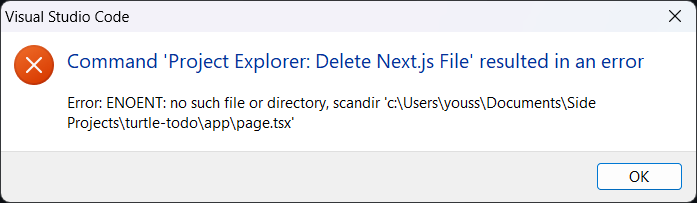

# Project Explorer README

A convenient extension for searching and creating page and layout files in a Next.js application project.

## Motivation

With the introduction of [Next.js 13](https://nextjs.org/), the `app` directory is now the default location for page and layout files. However, every page and layout file must be created manually and must be named with the `page.jsx` or `layout.jsx` (or `.tsx` for TypeScript projects). This extension aims to make it easier to create and search for page and layout files through commands and custom tree views.

## Features

You can access the Project Explorer through the command palette (`Ctrl+Shift+P` or `Cmd+Shift+P` on Mac) by searching for `Project Explorer`. This allows you to search for, create and delete page and layout files.

You can also access the Project Explorer through the sidebar. This allows you to search for and delete page and layout files. However, you can also rename file paths through the sidebar.

## Requirements

This extension works in Next.js 13 projects with `app` directory enabled **only**.

## Known Issues

When you delete a file through the command palette, VS Code will through an error saying that the file is not found. *See screenshot below*. This is a known issue with VS Code and is not related to this extension.

## Release Notes

### 0.1.0

Initial release of Project Explorer
